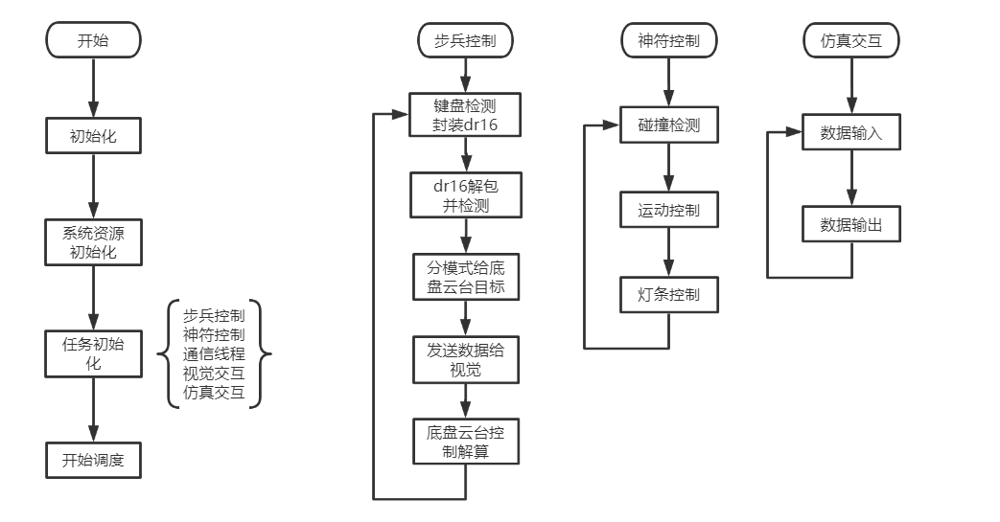

# 一、项目简介

## 1.项目功能

+ 通过vs程序对vrep模型的控制，可以
  验证机械模块的功能以及性能
  验证电控模块算法的正确性
  设置动力学参数，进一步可以验证机械模块以及电控算法性能
+ 通过vs与视觉程序交互，可以
  和视觉进行联调，验证神符自瞄、半自瞄，辅助打击等算法
+ 神符裁判系统模块，完成对神符的运动进行控制以及打击检测，可实现与官方神符裁判系统一样的功能，用于与视觉联调神符自瞄、半自瞄等算法；

## 2.项目修改

若用户想要增减模块，或者增减模块的功能，只需要更改UserTask中的任务。

# 二、文件结构

本节叙述项目文件结构，以及各个子文件的具体功能。

```cpp
├─ 用户接口 
│  ├─ 用户模块 
│  │  ├─ Infantry 步兵各个模块
│  │  └─ RUNE 神符各个模块
│  ├─ User_Task 以任务形式实现各个具体模块功能
│  ├─ System
│  │  ├─ System_Config 完成所有资源的初始化，创建所有任务
│  │  ├─ System_DataPool 任务具体实现需要用到的一些全局变量，如队列，串口资源等
│  │  └─ win32_support win32系统下需要用到的一些配置与接口
│  └─ main.c
├─ 中间层
│  ├─ SerialPort  win32串口封装，实现了对串口的基本操作：监听、发送等。
│  ├─ SimInterface  仿真交互接口  
│  │  ├─ CoppeiaSim 简单的封装基于vrep的Remote API，实现更简单高效地与vrep通信。
│  │  └─ simulation 对通信进行进一步封装，用户不需要再深究vs与vrep的通信
│  ├─ configurationFiles  工程的一些配置文件
│  │  └─ FreeRTOSConfig.h 操作系统用到的配置头文件
│  ├─ SRML 中间库
│  │  ├─ PID 
│  │  ├─ filters    
│  │  └─ dr16 
└─ 底层 
│  └─ FreeRTOS 操作系统内核文件
```

# 三、控制流程



